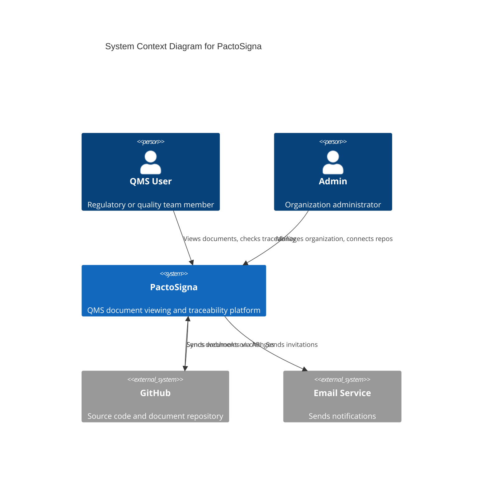

# High-Level Design: System Context

## 1. System Context Diagram

## 2. Key Actors

### QMS User
- Views synced documents
- Navigates traceability matrix
- Exports reports

### Administrator
- Creates organization
- Invites team members
- Connects GitHub repositories
- Manages settings

## 3. External Integrations

### GitHub
- OAuth App for user authentication (org connection)
- GitHub App for repository access
- Webhooks for real-time sync

### Email
- Firebase Auth email templates
- Custom invitation emails
