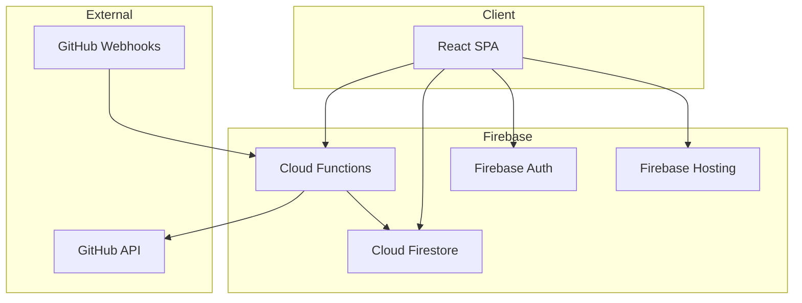

# System Architecture Overview

## 1. Introduction

This document describes the high-level architecture of PactoSigna.

## 2. Architecture Diagram

## 3. Component Overview

### 3.1 Frontend (React SPA)

- React 19 with TypeScript
- TanStack Router for routing
- TanStack Query for data fetching
- Firebase SDK for auth and Firestore

### 3.2 Backend (Cloud Functions)

- Node.js 20 runtime
- Firebase Functions v2
- Handles GitHub OAuth and webhooks
- Document sync processing

### 3.3 Database (Firestore)

Collections:
- `users` - User profiles
- `organizations` - Tenant organizations
- `repositories` - Connected GitHub repos
- `documents` - Synced document metadata
- `audit_logs` - System audit trail

## 4. Security Model

- All API calls authenticated via Firebase Auth
- Firestore rules enforce tenant isolation
- GitHub App uses installation tokens (not user tokens)
