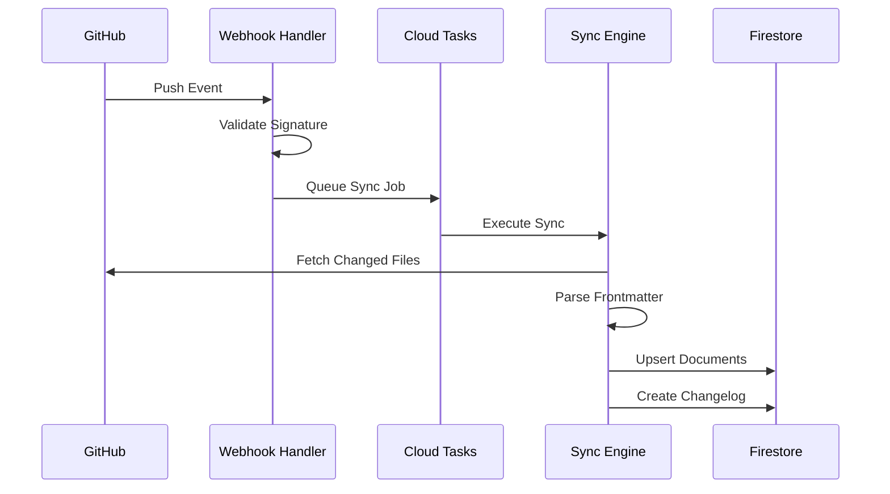

# Document Sync Engine Design

## 1. Overview

Design specification for the document synchronization engine.

## 2. Sync Flow



## 3. Module Design

### 3.1 Frontmatter Parser

```typescript
function parseFrontmatter(content: string): ParseResult {
  // Uses gray-matter library
  // Validates required fields
  // Returns typed metadata object
}
```

### 3.2 Document Type Inferrer

```typescript
function inferDocumentType(path: string, frontmatter: Metadata): DocumentType {
  // Check frontmatter.type first
  // Then match path patterns
  // Finally check filename prefix
}
```

### 3.3 Link Extractor

```typescript
function extractLinks(frontmatter: Metadata, content: string): string[] {
  // Combine frontmatter links
  // Parse inline [[LINK]] references
  // Deduplicate and validate
}
```

## 4. Error Handling

| Error Type | Handling |
|------------|----------|
| Invalid frontmatter | Skip document, log warning |
| GitHub API error | Retry 3 times with backoff |
| Firestore error | Fail job, alert ops |
