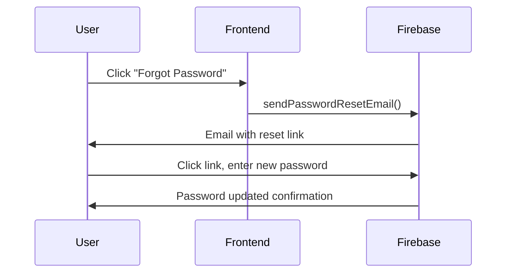

# Authentication System Software Requirements

## 1. Introduction

This document derives software requirements from URS-001.

## 2. System Requirements

### SRS-001-01: Firebase Authentication Integration

**Traces to:** URS-001-01, URS-001-02

The system shall use Firebase Authentication with:
- Email/password provider enabled
- Session persistence set to LOCAL
- Custom claims for role management

### SRS-001-02: Password Validation

**Traces to:** URS-001-01

Password requirements:
- Minimum 8 characters
- At least one uppercase letter
- At least one number
- At least one special character

### SRS-001-03: Session Management

**Traces to:** URS-001-02

- JWT tokens with 1-hour expiry
- Refresh tokens valid for 30 days
- Automatic token refresh on API calls

### SRS-001-04: Password Reset Flow

**Traces to:** URS-001-03

## 3. API Specifications

| Endpoint | Method | Description |
|----------|--------|-------------|
| /auth/register | POST | Register new user |
| /auth/login | POST | Authenticate user |
| /auth/logout | POST | End session |
| /auth/reset-password | POST | Initiate password reset |
